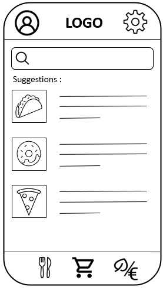
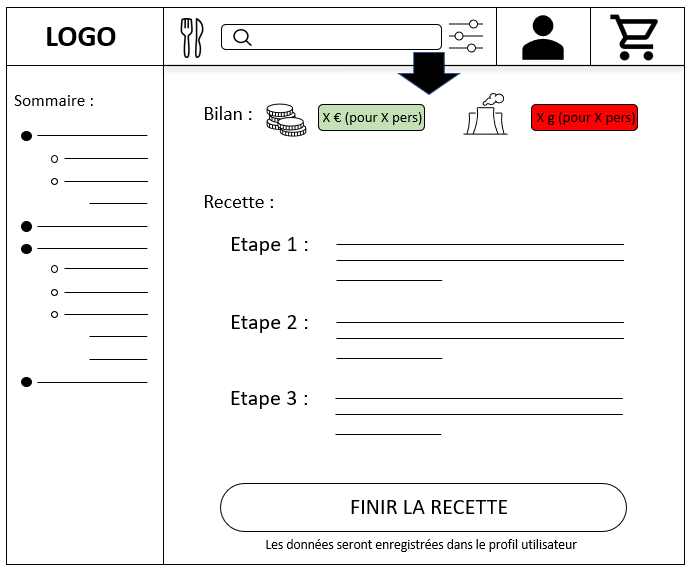
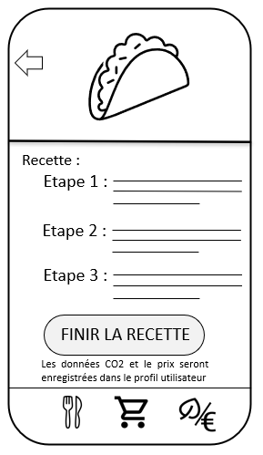
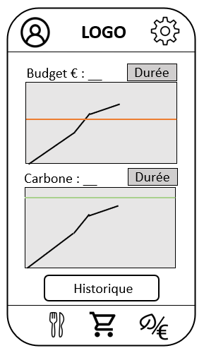

=== Interface utilisateur graphique

===== Notes

Les designs présentés ne sont absolument pas définitifs, mais simplement une idée de ce à quoi notre application et notre site pourraient ressembler.

==== Diagrammes d'utilisation des interfaces utilisateur

===== Interface utilisateur sur mobile

===== Interface utilisateur sur PC

==== Page d'accueil 

===== Page d'accueil sur PC

 

====== Page d'accueil sur mobile

====== Description

Sur la page d'accueil, l'utilisateur retrouve :

* Un outils de recherche de recettes
* Une présentation succincte des recettes résultats de la requête (les recettes recommandées si rien n'a été rentrée dans le champ de recherche)
* Un accès direct aux autres pages

==== Page de recette

===== Page de recette sur PC

 

On passe d'un écran à l'autre par défilement.

===== Page d'accueil sur mobile

 

On passe d'un écran à l'autre par défilement.

===== Description

Sur la page de recettes, l'utilisateur peut voir toutes les infos qui sont liées à la recette :

* Une image illustrant le plat
* Un brève description
* Une liste des ingrédients (il est possible de modifier la quantité de personnes utilisée pour calculer la quantité d'ingrédients)
* Une case permettant à l'utilisateur de définir l'origine de l'ingrédient (cette info servira au calcul du bilan carbone et à l'estimation du prix de la recette)
* Un bouton liste de courses, il permet à l'utilisateur d'ajouter ces ingrédients à la liste de courses 
* Une zone BILAN où seront indiqués l'estimation du prix de la recette et des émissions CO2 de la recette (ces estimations seront basées sur une BDD référençant le prix au kilo et le CO2 produit au kilo des ingrédients en fonction de leur origine)
* Une partie instructions de recette
* Un bouton finir la recette (il permet de sauvegarder les informations sur le prix et la quantité de carbone émise pour cette recette)

==== Page de courses

===== Page des courses sur mobile

Sur cette page, l'utilisateur peut consulter sa liste de courses, il y trouve :

* Les ingrédients qui y figurent
* La quantité dans la liste de chaque ingrédient
* Le prix estimé
* Un bouton ajouter 
* Le prix total de sa liste de courses

NB : À terme, cette page devrait aussi exister sur PC, mais le design n'est pas encore fait.

==== Page BILAN

===== Page de BILAN sur PC

 

===== Page de recette sur mobile

===== Description

C'est la page importante de notre application/ site web, elle permet à l'utilisateur d'accéder au bilan financier et carbone de son alimentation. Il y trouve :

* Un bouton permettant d'indiquer le budget de l'utilisateur (le budget financier et un objectif carbone)
* Des graphes montrant l'évolution de l'impact de sa consommation depuis une durée définie dans le bouton Durée
* Une barre horizontale sur les graphes, elle indique à l'utilisateur l'ordonnée de son budget ou de son objectif. La couleur de la barre dépend de :
** Est ce que la limite a-t-elle été dépassée ?
** De la différence entre le bilan et la limite
** De la différence de temps entre le moment présent et la fin de l'intervalle défini par durée (ainsi, si on est proche et en dessous de la barre mais qu'on est en début de mois, la barre sera plus rouge qu'en fin de mois)
** Un bouton menant à la page de l'historique, l'utilisateur y trouve l'historique des recettes réalisées et des courses faites

