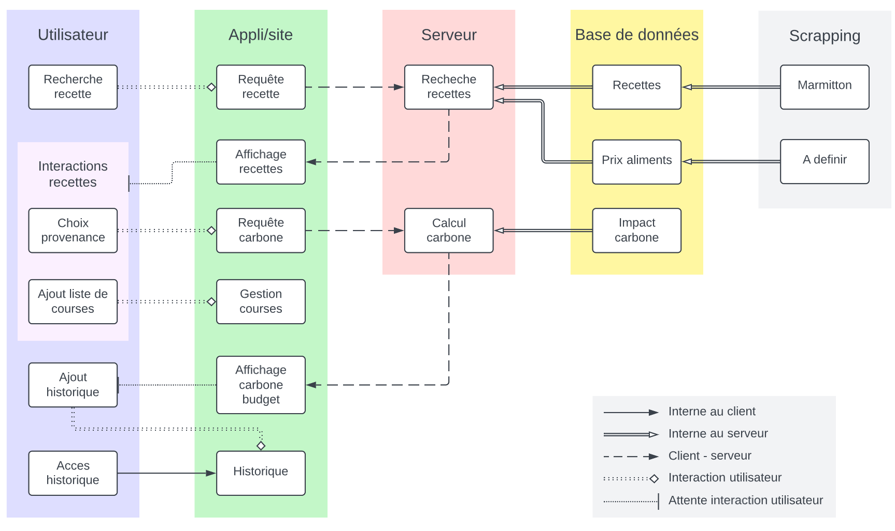

=== Schéma d’architecture

=== Description des blocs

==== Utilisateur

Dans ce bloc, on décrit toutes les démarches faites de la part de l'utilisateur via l'interface de l'application/du site.
On distingue différents sous-blocs:

 
====== Interaction recette:
L'objectif est de pouvoir permettre au client de rentrer les détails de provenance et d'emballage des différents ingrédients utilisés dans la recette.

====== Gestion Historique:
Le but est de pouvoir permettre à l'utilisateur de valider les recettes qu'il.elle a faites pour pouvoir les prendre en compte dans le bilan carbone de la personne.

==== Appli/Site 
L'application ou le site doit permettre de transmettre les requêtes faites par l'utilisateur au serveur.
Afficher les résultats, nottament les recettes. 
Gérer une liste de course. (Soit, faite par l'utilisateur qui peut faire la liste des ingrédients manuellement, soit, de façon automatique lorsque l'utilisateur sélectionne une recette qu'il désire faire plus tard.)

==== Serveur

Dans ce bloc, on a décrit les fonctionnalités qui devront faire appel aux bases de données:
La recherche de recettes
Le calcul de l'équivalent carbonne de l'alimentation de l'utilisateur

Et transmettre le tout à l'application.

==== Bases de données
Description des différentes bases de données envisagées pour le projet:

-Base de recettes pour pouvoir suggérer à l'utilisateurs de plats (fonction priemière de l'application)

-Base de prix des aliments: pour pouvoir estimer le budget dépensé par l'utilisateur en fonction du nombre de repas préparés.

-Base Impact carbone: base dans laquelle se trouveraient les infos nécessaires à l'estimation de l'équivalent carbone des repas préparés par l'utilisateur.

