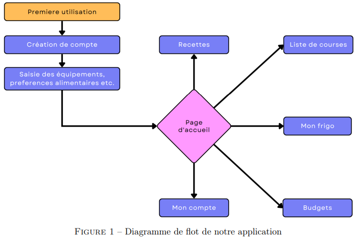

= Description de la proposition

== Motivation pour le projet
Notre projet PACT est de développer une application pour aider les étudiants avec leur alimentation. Ce qui nous a motivé est le fait que la plupart des étudiants mangent mal et se font rarement à manger. Beaucoup citent le fait que la gestion de budget est plus compliqué lorsque l'on se fait à manger soi-même. La plupart des étudiants ont aussi du mal à faire leurs courses par manque d'organisation et d'habitude. De plus ils sont soit peu sensibilisés à l'impact carbone de leur alimentation ou ne connaissent pas de moyens d'y avoir accès. Les 3 entretiens que nous avons fait nous ont n'ont fait que confirmer ce que l'ont pensait déjà. L'application GF1 répond à un besoin réel et concret. Nous avons également relevé le besoin d'avoir une application ergonomique, peu intrusive et facile à utiliser.

== Aspects principaux
En prenant en compte tout ce qui est détaillé ci-dessus, nous avons décidé que notre projet aurait 3 fonctionnalités principales que nous considérons le coeur de notre projet:

* suggestion des plats/création de listes de courses appropriées

* suivi du budget

* estimation d'empreinte carbone 

=== Suggestion des plats/création de listes de courses appropriées 
Pour la suggestion des plats, notre application proposera des recettes à notre utilisateur qui pourra faire des recherches de recettes et trier selon différents critères. GF1 enregistrera les recettes effectuées/appréciées pour faire des propositions adaptées à l'utilisateur. En outre, lorsqu'une recette est selectionnée, GF1 génèrera une liste de courses à faire pour réaliser cette recette. À l'aide d'un simple système de cochage, GF1 peut être utilisé lors de l'achat des courses pour être sûr de ne rien oublier.

=== Suivi du budget 
Notre application proposera de faire un suivi de budget en prenant en compte le budget de l'utilisateur et le prix des courses effectuées. L'utilisateur pourra aussi ajouter les achats qu'il a fait en dehors du cadre des recettes de l'application afin d'avoir un suivi précis même pour un utilisateur occasionnel.

=== Estimation d'empreinte carbone
GF1 connaitra l'empreinte carbone des aliments que l'utilisateur consomme. GF1 sera capable de faire un bilan sur un mois ou par repas de l'impact carbone des habitudes alimentaires de l'utilisateur.

== Facilité d'utilisation
Enfin, un aspect transversal dans notre projet sera le fait de créer une application simple, ergonomique, facile à utiliser et le moins intrusif possible. Ce sont des caractéristiques très importantes pour n'importe quel application mais en particulier pour nous. En effet, le publique que nous visons (les étudiants) sont très regardant sur la facilité d'utilisation d'une application. Notre diagramme de flot simple et clair illustre ce principe:

